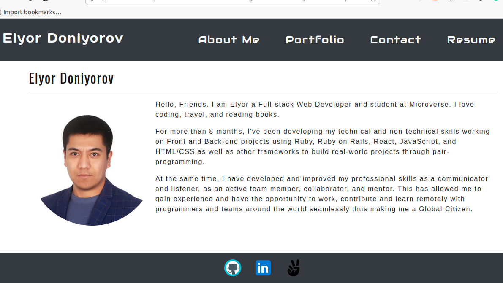

# Elyor Doniyorov

## Built With

- React.js

## Live demo

[Netlify Live link]()

## Getting Started

### To get a local copy run the following steps:

- Copy this link ``
- Open your terminal or command line
- Run `git clone` and paste the link
- Open the folder with your code editor
- Create a branch to work on
- Run `npm install`
- Run `npm start` to launch the server.

## Author

👤 **Elyor Doniyorov**

- Github: [@elyor-doniyorov](https://github.com/elyor-doniyorov)
- LinkedIn: [@elyor-doniyorov](www.linkedin.com/in/elyor-doniyorov)

## 🤝 Contributing

Contributions, issues, and feature requests are welcome!

Feel free to check the [issues page]().

## Show your support

Give a ⭐️ if you like this project!

## Acknowledgments

- Learning partners, Standup and morning session team